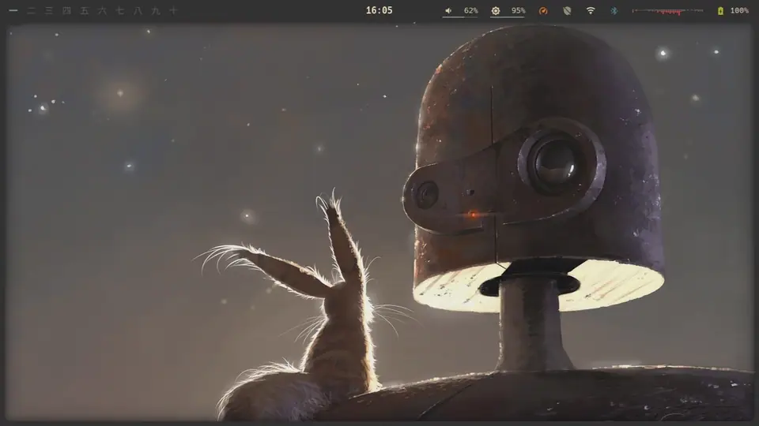

# frameshell

A desktop shell for [Hyprland](https://hyprland.org), built on
[Quickshell](https://quickshell.org). A frame wraps the screen and everything
opens out of it: the bar along the top, a dashboard and notification drawer on
the left, a control centre and agent chat on the right, and a launcher along
the bottom. The lock screen is the same frame closing over the desktop.



The same clip as a [video](assets/demo.mp4).

## Requirements

- Hyprland and Quickshell 0.3 or newer
- A Nerd Font for the icons (Symbols Nerd Font works with any text font)
- PipeWire, NetworkManager, BlueZ and UPower for the bar and control centre

Everything else is optional; a feature hides itself when its tool is missing.

| Feature | Needs |
|---|---|
| Screenshots, lock screen backdrop, agent screen capture | `grim`, `slurp` |
| Clipboard history, image paste | `wl-clipboard` |
| Screen recording | `wf-recorder` |
| Brightness | `brightnessctl` |
| Night mode | `hyprsunset` |
| Keep awake | `hypridle` |
| Wallpaper picker | `awww`, `swww` or `hyprpaper`; ImageMagick or `ffmpeg` for thumbnails |
| Weather | `curl` |
| Update count | `checkupdates` (Arch), `yay` for the AUR |
| VPN | Mullvad's `mullvad` CLI |
| Charge limit | a battery with `charge_control_end_threshold`, or `framework_tool` |
| Agent tab | [Claude Code](https://claude.com/claude-code) and/or Codex |

## Install

```sh
git clone <this repo> ~/.config/quickshell/frameshell
qs -c frameshell
```

Start it with Hyprland and bind the panels. `examples/hyprland.conf` has the
full set and `examples/hypridle.conf` the idle and lock setup; the short
version:

```ini
exec-once = qs -c frameshell -d

bind = SUPER, Space, exec, qs -c frameshell ipc call shell launcher apps
bind = SUPER, D, exec, qs -c frameshell ipc call shell drawer dashboard
bind = SUPER, C, exec, qs -c frameshell ipc call shell controls
bind = SUPER, A, exec, qs -c frameshell ipc call shell agent
bind = SUPER, L, exec, qs -c frameshell ipc call shell lock
```

## Commands

Everything is reachable through `qs -c frameshell ipc call shell <command>`.

| Command | Opens |
|---|---|
| `launcher apps\|themes\|fonts\|wallpapers\|session` | the launcher in that mode |
| `drawer dashboard\|windows\|clipboard` | the left drawer on that tab |
| `controls` | the control centre |
| `agent` | the agent chat |
| `screenshot region\|screen\|clip\|clipScreen` | a screenshot to `~/Pictures/Screenshots` or the clipboard |
| `lock` | the lock screen |
| `close` | closes whatever is open |
| `theme <name>` | switches theme without running the theme hook |
| `font <family>` | switches font without running the font hook |

## Configuration

`~/.config/frameshell/config.json` is created the first time you pick a theme.
Every key is optional, and edits apply while the shell is running.

```json
{
    "theme": "gruvbox",
    "font": "JetBrains Mono",
    "wallpaperDir": "~/Pictures/Wallpapers",
    "weather": "London",
    "hooks": {
        "theme": "my-theme-switcher \"$1\"",
        "font": "",
        "wallpaper": ""
    }
}
```

- `theme`: a name from `themes/`, or from `~/.config/frameshell/themes/`.
- `font`: a monospace family. Empty uses the first installed fallback.
- `wallpaperDir`: the folder the wallpaper picker lists.
- `weather`: a place name. Empty hides the weather.
- `hooks`: shell commands run after a pick in the launcher, with the theme
  name, font family or wallpaper path as `$1`. A `wallpaper` hook replaces the
  built-in wallpaper setter. Use them to retheme the rest of your desktop.

## Themes

A theme is twelve colours. Copy one from `themes/` into
`~/.config/frameshell/themes/<name>.json` and edit it; a file there with the
same name as a bundled theme overrides it. A `<name>-light` theme is listed as
the light variant of `<name>`.

```json
{
    "bg": "#282828",
    "surface": "#3c3836",
    "muted": "#978e77",
    "fg": "#ebdbb2",
    "fgBright": "#fbf1c7",
    "accent": "#83a598",
    "blue": "#458588",
    "red": "#fb4934",
    "green": "#b8bb26",
    "yellow": "#fabd2f",
    "orange": "#fe8019",
    "purple": "#d3869b"
}
```

## Agent tab

The second tab of the control centre is a chat with Claude Code or Codex,
whichever is installed, running in a scratch folder with tool approvals shown
in the panel. `Ctrl S` opens its settings, `Ctrl H` the session history and
`Ctrl P` attaches a screenshot.

## Layout

| Folder | Holds |
|---|---|
| `modules/` | what you see: `frame`, `bar`, `drawer`, `controls`, `launcher`, `lock`, `popouts`, `agent` |
| `services/` | state and system access, grouped as `agent`, `config`, `desktop`, `system` |
| `widgets/` | shared building blocks |
| `style/` | colours, sizes and animation curves |
| `scripts/` | shell helpers, grouped like the services that call them |
| `themes/` | the bundled colour themes |
| `examples/` | Hyprland and hypridle snippets |
| `assets/` | the demo clip |

## Where things are kept

| What | Where |
|---|---|
| Settings | `~/.config/frameshell/` |
| Agent sessions, recent VPN locations | `~/.local/state/frameshell/` |
| Clipboard history, update count, wallpaper thumbnails | `~/.cache/frameshell/` |

## Licence

MIT. See `LICENSE`. Inspired by [caelestia](https://github.com/caelestia-dots/shell).
